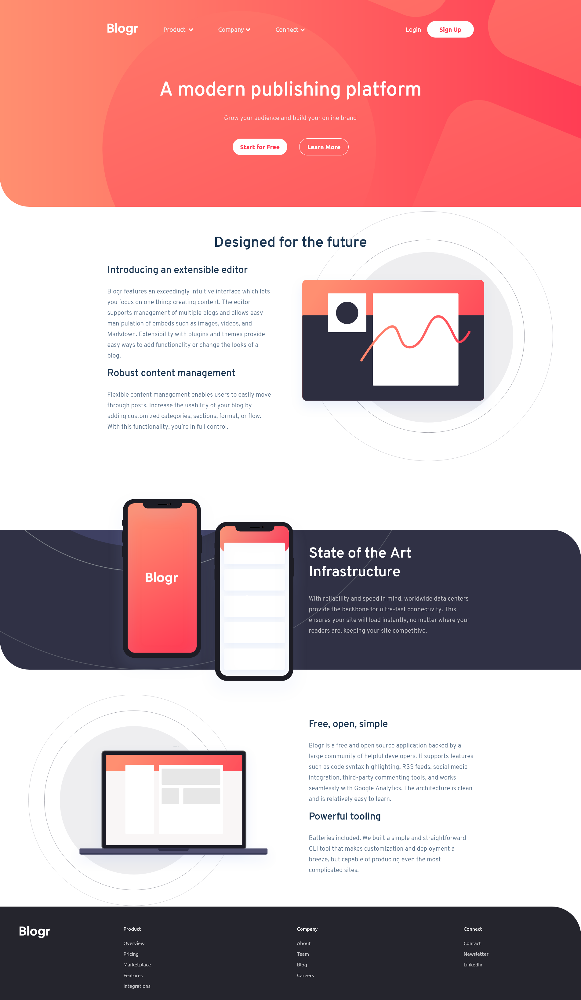
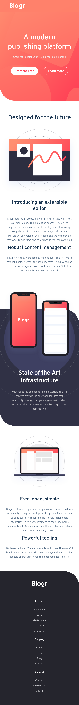

# Frontend Mentor - Blogr landing page solution

This is a solution to the [Blogr landing page challenge on Frontend Mentor](https://www.frontendmentor.io/challenges/blogr-landing-page-EX2RLAApP). Frontend Mentor challenges help you improve your coding skills by building realistic projects.

## Table of contents

- [Overview](#overview)
  - [The challenge](#the-challenge)
  - [Screenshot](#screenshot)
  - [Links](#links)
- [My process](#my-process)
  - [Built with](#built-with)
  - [What I learned](#what-i-learned)
  - [Continued development](#continued-development)
  - [Useful resources](#useful-resources)
- [Author](#author)
- [Acknowledgments](#acknowledgments)

## Overview

### The challenge

Users should be able to:

- View the optimal layout for the site depending on their device's screen size
- See hover states for all interactive elements on the page

### Screenshot

### Links

- Solution URL: [GitHub Repository](https://github.com/iceofice/frontend-mentor/tree/main/Blogr%20Page)
- Live Site URL: [GitHub Pages](https://iceofice.github.io/frontend-mentor/Blogr%20Page)

## My process

### Built with

- Semantic HTML5 markup
- CSS
- Flexbox
- Mobile-first workflow
- Native JavaScript

### What I learned

I learned more about image handling, positioning and other stuff. I learned more about JS, to make the sticky header, add a onPress function (Event Listener).

### Continued development

I still having trouble with animations, general css, like the styling and best practices.

## Author

- Renaldy Prasetio
- Frontend Mentor - [@iceofice](https://www.frontendmentor.io/profile/iceofice)
- Instagram - [@renaldyprasetio](https://www.instagram.com/renaldyprasetio)
