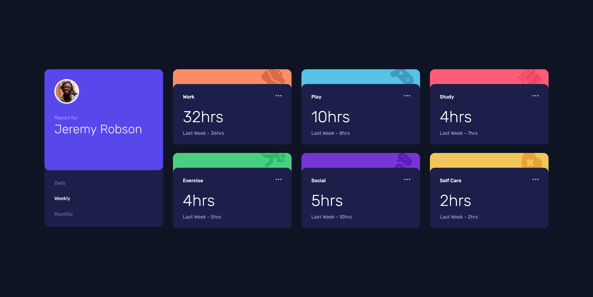

# Frontend Mentor - Time tracking dashboard solution

This is a solution to the [Time tracking dashboard challenge on Frontend Mentor](https://www.frontendmentor.io/challenges/time-tracking-dashboard-UIQ7167Jw). Frontend Mentor challenges help you improve your coding skills by building realistic projects.

## Table of contents

- [Overview](#overview)
  - [The challenge](#the-challenge)
  - [Screenshot](#screenshot)
  - [Links](#links)
- [My process](#my-process)
  - [Built with](#built-with)
  - [What I learned](#what-i-learned)
  - [Continued development](#continued-development)
- [Author](#author)

**Note: Delete this note and update the table of contents based on what sections you keep.**

## Overview

### The challenge

Users should be able to:

- View the optimal layout for the site depending on their device's screen size
- See hover states for all interactive elements on the page
- Switch between viewing Daily, Weekly, and Monthly stats

### Screenshot




### Links

- Solution URL: [GitHub Repository](https://github.com/iceofice/frontend-mentor/tree/main/Time%20Tracking)
- Live Site URL: [GitHub Pages](https://iceofice.github.io/frontend-mentor/Time%20Tracking)

## My process

### Built with

- HTML
- CSS Grid
- JavaScript

### What I learned

I learned how to use CSS Grid, Media Query and Basic Javascript.

#### Grid

```css
.container {
  display: grid; /* To use grid layout */
  /* Different Grid properties such as : */
  grid-template-columns: 20% 20% 20% 20%; /* To set columns width */
  grid-template-rows: 15rem; /* To set rows height */
  grid-gap: 2em; /* To set gap between the grid components */
}
```

#### Media Query

```css
@media (min-width: 1200px) {
  /* Any properties where the width of the screen is at least 1200px  (desktop) */
}
```

#### Using the data.json

```js
var rawFile = new XMLHttpRequest();
rawFile.overrideMimeType("application/json");
rawFile.open("GET", "data.json", true);
rawFile.onreadystatechange = function () {
  if (rawFile.readyState === 4 && rawFile.status == "200") {
    data = JSON.parse(rawFile.responseText);
    assignData("weekly");
  }
};
```

#### Add and Remove class

```js
// Remove class from element
/// Using query selector to specify the elements,
//// # is the id
//// . is the class
document.querySelector("#timeframes a.active").classList.remove("active");

// To set class
element.target.className = "active";
```

### Continued development

Learning more about JS to learn the fundamental and apply some good programming concept for e.g. DRY and KISS.

```js
function assignData(timeframe) {
  document.getElementById("workHours").innerHTML = data[0].timeframes[timeframe].current;
  document.getElementById("workPrev").innerHTML = data[0].timeframes[timeframe].previous;

  document.getElementById("playHours").innerHTML = data[1].timeframes[timeframe].current;
  document.getElementById("playPrev").innerHTML = data[1].timeframes[timeframe].previous;

  document.getElementById("studyHours").innerHTML = data[2].timeframes[timeframe].current;
  document.getElementById("studyPrev").innerHTML = data[2].timeframes[timeframe].previous;

  document.getElementById("exerciseHours").innerHTML = data[3].timeframes[timeframe].current;
  document.getElementById("exercisePrev").innerHTML = data[3].timeframes[timeframe].previous;

  document.getElementById("socialHours").innerHTML = data[4].timeframes[timeframe].current;
  document.getElementById("socialPrev").innerHTML = data[4].timeframes[timeframe].previous;

  document.getElementById("selfCareHours").innerHTML = data[5].timeframes[timeframe].current;
  document.getElementById("selfCarePrev").innerHTML = data[5].timeframes[timeframe].previous;
}
```

In the code block above, I am sure there are other ways to make it more "DRY" where now I use the similar code repetitively

## Author

- Renaldy Prasetio
- Frontend Mentor - [@iceofice](https://www.frontendmentor.io/profile/iceofice)
- Instagram - [@renaldyprasetio](https://www.instagram.com/renaldyprasetio)
